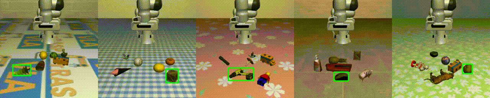

# GraspVLA Simulation Environment

This repository provides simulation benchmarks for [GraspVLA](https://github.com/PKU-EPIC/GraspVLA), featuring both the popular [LIBERO](https://github.com/Lifelong-Robot-Learning/LIBERO) benchmark and an enhanced playground environment built on top of it.

## Features

Our playground environment offers the following capabilities:
- **Diverse Objects**: Randomly sample objects from the [Objaverse dataset](https://objaverse.allenai.org/)
- **Diverse Layouts**: Randomly generate initial scene configurations
- **Diverse Environments**: Randomly sample background styles and textures



## Installation

### Prerequisites
Ensure you have git-lfs installed, as this repository contains large object and robot assets (~1 GB):
```bash
sudo apt install git-lfs
```

### Step 1: Clone the Repository
```bash
git clone https://github.com/yanmi/GraspVLA-release.git
cd GraspVLA-release
```

### Step 2: Set Up Python Environment
Create and activate a conda environment with the required dependencies:
```bash
conda create -n playground python=3.8.13
conda activate playground
pip install -r requirements.txt
```

### Step 3: Install Core Dependencies
Install the required third-party packages:
```bash
cd third_party/robosuite
pip install -e .
cd ../bddl
pip install -e .
cd ..
```

### Step 4: Install cuRobo
Install [cuRobo](https://curobo.org/get_started/1_install_instructions.html) with the appropriate CUDA and PyTorch versions. Note that PyTorch >= 1.10 is required, and installation takes approximately 20 minutes. We attach the command we used here for reference.

```bash
git clone https://github.com/NVlabs/curobo.git
cd curobo
export CUDA_HOME=/usr/local/cuda-11.8
pip install torch==2.2.2 torchvision==0.17.2 torchaudio==2.2.2 --index-url https://download.pytorch.org/whl/cu118
pip install -e . --no-build-isolation
cd ..
```

### Step 5: Configure Robot Assets
Update the paths in `assets/franka_with_extended_finger/franka.yml` to use absolute paths for:
- `urdf_path`: Path to `franka_with_extended_finger.urdf`
- `asset_root_path`: Path to `franka_with_extended_finger` directory
- `collision_spheres`: Path to `collision_spheres.yml`

## Usage

### Starting the Model Server
Before running any simulations, you must start the model server. For detailed instructions, see the [model server documentation](https://github.com/yanmi/GraspVLA-release/tree/main/model_server).

To validate that the server is running correctly:
```bash
python validate_server.py --host 127.0.0.1 --port 6666 --timeout 5
```
A green checkmark indicates the server is ready for use.

### Running the Playground
Once the model server is active, launch the playground environment:
```bash
python playground.py
```

The playground is configured through `config/playground.yaml`. By default, it:
- Randomly samples 6 objects from the Objaverse dataset
- Randomly samples texture maps from `libero/libero/assets/textures` for floors and walls
- Runs 10 trials with different random seeds

You can customize seeds, object counts, and other parameters in the configuration file.

To calculate success rates after running experiments:
```bash
python misc/get_success_rate_per_object.py
```

### Running LIBERO Benchmark
Once the model server is active, launch the LIBERO benchmark evaluation as shown below. Configuration options are available in `config/evaluate_libero_tasks.yaml`.
```bash
python evaluate_libero_tasks.py
```

For faster evaluation, run multiple environments in parallel. Adjust the `parallel_env_num` parameter in `config/parallel_eval.yaml` to control the number of concurrent environments.
```bash
python parallel_eval.py
```

## Citation

If you find this work useful, please cite:

```bibtex
@article{deng2025graspvla,
    title={GraspVLA: a Grasping Foundation Model Pre-trained on Billion-scale Synthetic Action Data}, 
    author={Shengliang Deng and Mi Yan and Songlin Wei and Haixin Ma and Yuxin Yang and Jiayi Chen and Zhiqi Zhang and Taoyu Yang and Xuheng Zhang and Heming Cui and Zhizheng Zhang and He Wang},
    year={2025},
    eprint={2505.03233},
    archivePrefix={arXiv},
    primaryClass={cs.RO},
    url={https://arxiv.org/abs/2505.03233}
}
```